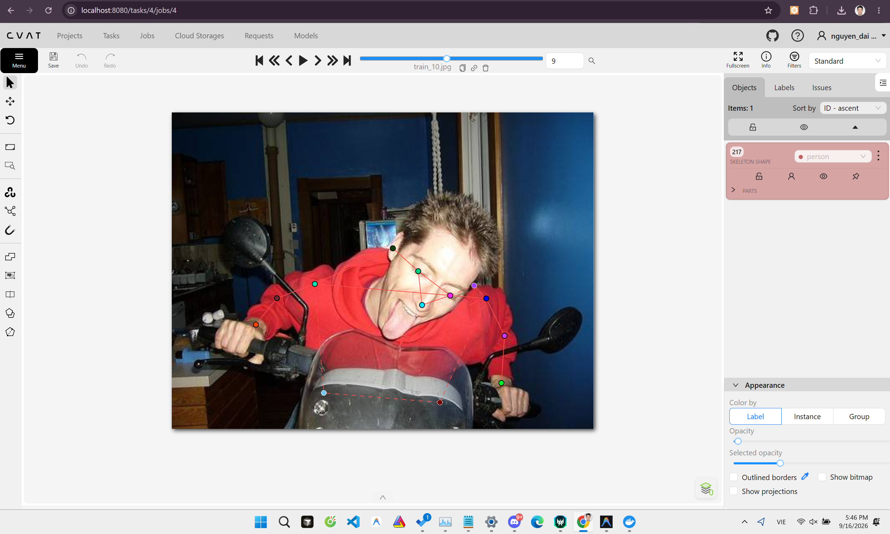
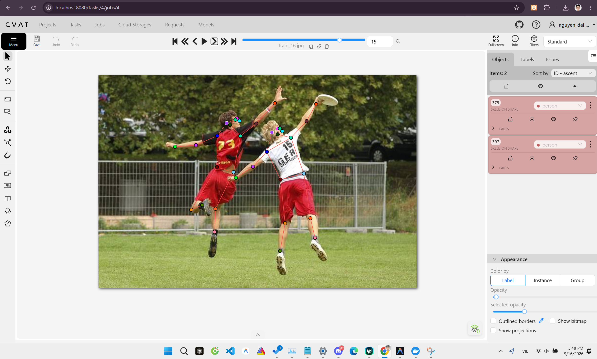
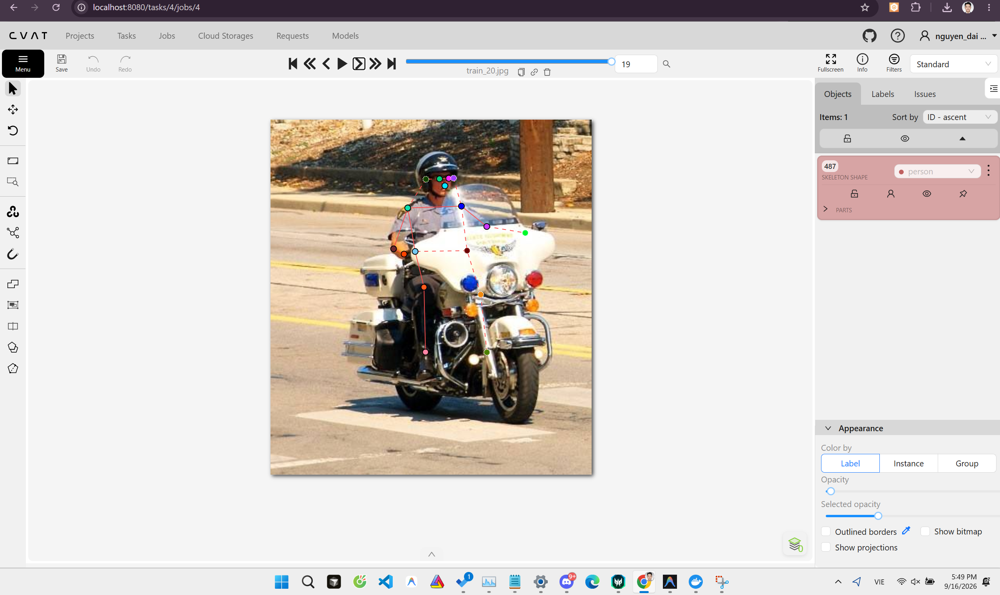

# Mini guideline - nhóm: Cá nhân  |  người gán: Nguyễn Đại Hoàng  |  ngày: 16/09/2026

> Điền file này **trong lúc** gán nhãn, không phải sau khi xong. Mỗi lần bạn dừng lại
> hơn 10 giây để phân vân, đó là một dòng phải ghi vào đây.

## 1. Luật bắt buộc (đã thống nhất cả lớp - không sửa)

- Bộ 17 điểm COCO, đúng tên, đúng thứ tự. Lấy từ file `.SVG` chung.
- Mọi người trong ảnh đều có **đủ 17 điểm**. Điểm không dùng được thì gắn cờ, không xoá.
- Trái/phải tính theo **cơ thể người**, không theo bức ảnh.
- Bị che, còn trong khung -> `v = 1`, **vẫn đặt chấm** ở vị trí ước lượng.
- Ra ngoài mép ảnh -> `v = 0`, **không** đặt chấm.
- Không dùng `Hidden` (`h`) - nó không được lưu vào file.

## 2. Luật của nhóm bạn (phải điền)

| Tình huống | Luật nhóm bạn chọn | Vì sao |
| --- | --- | --- |
| Hông của người mặc quần áo dài | v=1, đặt chấm ước lượng tại trục ngang của thắt lưng / nếp gấp quần. | Dù bị che bởi lớp vải, cấu trúc khung xương vẫn suy luận được chắc chắn. |
| Tai bị tóc hoặc mũ bảo hiểm che một phần | v=1, dóng từ mắt và mũi sang ngang dọc theo viền mũ bảo hiểm. | Mũ bảo hiểm (đặc biệt trong ảnh giao thông) che hoàn toàn tai nhưng vị trí tai luôn cố định so với mắt/mũi. |
| Người bị cắt ở mép ảnh (chỉ thấy từ hông trở lên) | Các khớp ở ngoài khung hình đặt v=0, không kéo điểm ra ngoài. | Tránh nhiễu toạ độ cho mô hình khi train; đúng chuẩn COCO. |
| Cổ tay nằm sau tay lái / sau thân mình | v=1 nếu đoán được góc gập của khuỷu tay; v=0 nếu bị che hoàn toàn không có cơ sở ước lượng. | Ép đặt điểm khi không có cơ sở sẽ làm sai lệch cấu trúc xương cánh tay. |
| Hai người chồng lên nhau | Gán ưu tiên chủ thể phía trước (v=2), chủ thể bị che phía sau đặt v=1. | Đảm bảo không bị "nhầm người" (gắn nhầm tay người này sang người kia). |
| Người nhỏ đến mức nào thì không gán nữa | Bỏ qua nếu người lấp ló ở hậu cảnh xa, bị che khuất hơn 85% hoặc quá mờ. | Tránh việc mô hình học các bóng mờ không rõ tư thế, gây nhiễu precision. |

**Ảnh minh hoạ các tình huống trên:**

*train_10 — Hông/chân bị xe che khuất (v=1, chấm ước lượng giữa khung hình):*

*train_16 — Hai người chồng lên nhau, dễ nhầm trái/phải person-centric:*

*train_20 — Cổ tay/cổ chân sau tay lái + mũ bảo hiểm che tai (v=1, dóng từ đầu gối):*

## 3. Ba ca mơ hồ đã gặp (bắt buộc, ghi ít nhất 3)

### Ca 1 - ảnh `train_10`, người thứ `1`, khớp `chân/hông`

- Mơ hồ ở chỗ nào: Người nằm hoàn toàn gọn giữa ảnh nhưng chân/hông bị xe che khuất rất nhiều.
- Bạn quyết thế nào: Đặt `v = 1` và chấm điểm ước lượng thay vì `v = 0`.
- Vì sao: Người không bị cắt bởi mép ảnh, khớp vẫn nằm trong khung hình (nhưng bị che), phải dùng `v = 1` theo đúng guideline. (Terminal đã cảnh báo lỗi này).
- Nếu người khác quyết ngược lại thì model học sai cái gì: Nếu để `v=0`, model sẽ hiểu nhầm là chủ thể bị cắt bởi camera thay vì bị đồ vật che khuất.

### Ca 2 - ảnh `train_16`, người thứ `1`, khớp `left_shoulder / right_shoulder`

- Mơ hồ ở chỗ nào: Người quay lưng hoặc đứng chéo, rất khó phân biệt trái/phải nếu nhìn lướt qua.
- Bạn quyết thế nào: Xác định trục xương sống, áp dụng quy tắc "trái/phải theo cơ thể người" (person-centric) để đảo lại nhãn cho đúng.
- Vì sao: Do góc nhìn từ camera gây ảo giác quang học (terminal báo lỗi vai/hông ngược chiều với mắt).
- Nếu người khác quyết ngược lại thì model học sai cái gì: Model sẽ học sai toàn bộ cấu trúc động học (nhận diện tay trái thành tay phải), khi Data Augmentation lật ảnh ngang (fliplr) model sẽ càng bị phạt lỗi nặng hơn.

### Ca 3 - ảnh `train_20`, người thứ `1`, khớp `right_ankle`

- Mơ hồ ở chỗ nào: Chân người đi xe máy mặc đồ đen, giày đen tệp hoàn toàn vào bóng râm của lốp xe và mặt đường.
- Bạn quyết thế nào: Đặt `v=1`, dóng từ đầu gối (right_knee) thẳng xuống vị trí để chân của xe máy.
- Vì sao: Bóng râm che mất viền chi tiết, nhưng cấu trúc xe máy cho phép nội suy chính xác vị trí đặt bàn chân.
- Nếu người khác quyết ngược lại thì model học sai cái gì: Model sẽ mất khả năng suy luận vị trí các chi dựa trên logic không gian xung quanh (như dáng ngồi xe máy).

## 4. Kiểm chéo với nhóm

- Khớp lệch `%v=1` nhiều nhất: Bỏ qua
- Nguyên nhân là **guideline chưa rõ** hay **một trong hai bên gán sai**: Do làm bài cá nhân nên chưa thực hiện kiểm chéo với bạn cùng nhóm.
- Luật mới bổ sung vào mục 2 sau khi thống nhất: (Tự thống nhất với guideline gốc, đã liệt kê đầy đủ ở Mục 2).